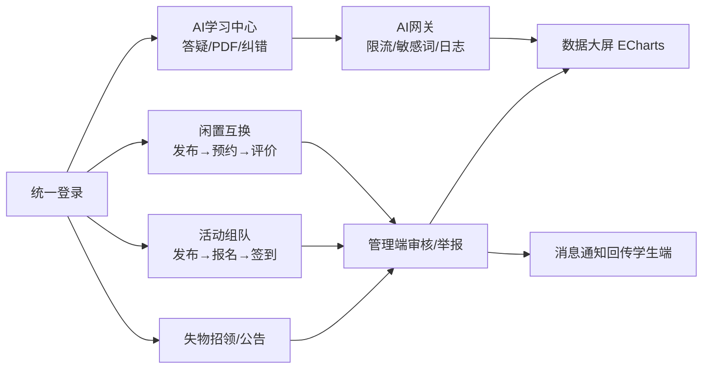

# 基于SpringBoot的AI校园综合服务平台 —— 产品需求文档（PRD）

| 项 | 内容 |
|---|---|
| Language | 中文 |
| Programming Language | 后端：Java 17 + SpringBoot 3.x + MyBatis-Plus + MySQL 8 + Redis + MinIO + JWT + PDFBox；Web双端：Vue 3 + Vite + Element Plus + Pinia（管理端 + ECharts 5）；小程序：原生微信小程序（WXML/WXSS/JS） |
| Project Name | ai_campus_platform |
| 版本 | v1.0（毕业设计答辩版） |
| 原始需求 | 设计并实现一套三端协同（Web学生前台 + Web管理后台 + 原生微信小程序）的AI校园综合服务平台。核心引入大模型AI能力（答疑、代码纠错、PDF解析问答、提纲生成、错题本、智能习题），覆盖校园闲置互换、活动组队、失物招领、公告推送、动态社交、消息通知等学习生活场景；管理端提供用户管控、内容审核、举报闭环、AI参数配置与ECharts数据大屏，构建"学生自主使用 + 平台规范管理"的闭环智慧校园服务体系。 |

---

## 一、产品定义

### 1.1 Product Goals（产品目标）

1. **AI赋能学习场景**：通过独立AI网关对接第三方大模型，为学生提供答疑、代码纠错、PDF课件问答等智能学习服务，突破传统校园系统无AI能力的短板，AI对话一次问答成功率（得到用户无追问/无差评的可用回答）≥ 85%。
2. **三端一体化的校园生活服务**：Web前台、管理后台、微信小程序共用同一后端，实现闲置互换、活动组队、失物招领、公告、社交等场景的账号互通、数据同步，核心生活链路（发布→审核→互动→完成）可在 Web 与小程序任一端独立完成。
3. **可管控的平台运营闭环**：管理端实现"内容审核 + 举报处置 + 用户封禁 + AI参数可调 + 数据可视"的完整管控链路，全部用户发布内容 100% 经审核后公开，AI调用 100% 可限流、可追溯。

### 1.2 User Stories（用户故事）

1. As a **学生用户**，我想在遇到课程难题时直接向AI提问并支持多轮上下文追问，以便获得连贯的答疑辅导，而不必跳转到外部AI工具。
2. As a **学生用户**，我想上传PDF课件后针对文档内容多轮提问，以便快速复习课件重点、定位知识点。
3. As a **学生用户**，我想提交报错的代码并收到带高亮说明的纠错结果，以便定位并修复编程作业中的问题。
4. As a **学生用户**，我想在小程序上发布闲置物品、浏览活动并扫码签到，以便在移动端随时随地参与校园生活场景。
5. As a **管理员**，我想对闲置/活动/失物信息进行待审队列式审核，并对违规内容驳回或下架、对举报形成处置闭环，以便保障平台内容安全合规。
6. As a **管理员**，我想在数据大屏上查看用户增长、AI调用量、各模块发布量趋势，以便掌握平台运营状况并支撑答辩演示。

---

## 二、需求池（Requirements Pool）

优先级说明：**P0 = 必须实现**（构成答辩演示主链路，缺一则演示断裂）；**P1 = 重要**（功能完整性要求，开题报告承诺）；**P2 = 增强**（锦上添花，时间不足可裁剪）。

### 2.1 账号与基础服务（后端/三端共用）

| # | 需求 | 优先级 | 验收标准 |
|---|---|---|---|
| A1 | Web端账号密码注册/登录，JWT鉴权，路由守卫拦截未登录访问 | P0 | 未登录访问受限页面自动跳转登录页 |
| A2 | 小程序 `wx.login` code 换 openid 自动建号，与Web端同一JWT体系 | P0 | 同一用户在Web与小程序登录后数据一致 |
| A3 | 小程序绑定学号/手机号，与Web账号密码账号合并指向同一用户 | P1 | 绑定后两端登录看到同一套个人数据 |
| A4 | 统一图片/文件上传（MinIO），先传文件拿URL再随表单提交 | P0 | 三端上传均可回显访问URL |
| A5 | 管理员独立登录接口 + 角色字段，管理后台动态路由按权限生成 | P0 | 非管理员账号无法进入管理后台 |
| A6 | 全局异常处理与统一响应封装、接口参数校验 | P0 | 异常请求返回结构化错误信息，不暴露堆栈 |

### 2.2 AI学习服务（学生端核心，Web前台 + 小程序）

| # | 需求 | 优先级 | 验收标准 |
|---|---|---|---|
| B1 | AI答疑对话：会话列表 + 对话窗，上下文记忆，Web端流式输出（SSE/分段轮询） | P0 | 多轮对话可引用上文，回复内容随生成逐步展示 |
| B2 | 独立AI网关：提示词模板DB可配、Redis限流（每用户每日次数）、超时重试、DFA敏感词过滤 | P0 | 超限额返回友好提示；敏感输入被拦截；限流阈值后台可改 |
| B3 | PDF解析问答：上传PDF（Web `el-upload` / 小程序 `wx.chooseMessageFile`）→ PDFBox提取 → 针对文档多轮提问 | P0 | 50页以内PDF 30秒内完成解析并进入问答 |
| B4 | 代码纠错：代码编辑器 + 语言选择，结果 Markdown 渲染 + 语法高亮 | P0 | 提交含语法错误的代码可返回错误定位与修复建议 |
| B5 | 复习提纲生成：输入学科/章节/主题，AI生成结构化提纲，可复制导出 | P1 | 生成提纲包含层级化要点 |
| B6 | 错题本：手动/自动收录错题，按学科标签筛选管理 | P1 | 错题可增删改查、按标签过滤 |
| B7 | 智能习题推荐：基于错题本"生成同类习题"，AI出题并给解析 | P1 | 每道错题可生成≥3道同类题 |
| B8 | AI会话历史持久化（`ai_session`/`ai_message`），历史会话可回看、可删除 | P1 | 重新登录后历史对话完整可查 |
| B9 | 小程序AI对话：一次性返回 + loading 动画（或分片轮询），代码块用 rich-text/towxml 渲染 | P1 | 小程序端AI问答功能可用且排版不乱 |

### 2.3 校园生活模块（Web前台 + 小程序）

| # | 需求 | 优先级 | 验收标准 |
|---|---|---|---|
| C1 | 闲置互换：发布（图片+描述+期望换物）、列表检索、详情、预约、双方确认、互评 | P0 | 完整走通"发布→审核通过→预约→互换→评价"闭环 |
| C2 | 活动组队：发布活动、浏览/检索、报名（含组队）、报名名单管理 | P0 | 发布者可见报名名单，报名状态实时更新 |
| C3 | 活动签到：发布者展示签到二维码，参与者小程序 `wx.scanCode` 扫码签到 | P1 | 扫码后签到记录入库并展示 |
| C4 | 失物招领：发布（失物/招领两类）、图文检索、详情、认领联系 | P0 | 信息审核通过后公开可查，认领后可标记完成 |
| C5 | 校园公告：列表轮播展示、详情阅读（管理员发布，见D4） | P0 | 新公告在三端首页可见 |
| C6 | 动态广场：发布图文动态、点赞、评论 | P1 | 动态审核通过后可见，互动计数正确 |
| C7 | 消息通知中心：系统/互动消息列表、已读管理（审核结果、预约、报名等触发） | P0 | 关键业务事件触发消息，未读角标正确 |
| C8 | 微信小程序订阅消息：报名成功、审核结果、预约提醒等服务通知触达 | P1 | 用户授权后可在微信服务通知收到提醒 |
| C9 | 个人中心：资料编辑、我的发布、我的报名、错题本入口 | P0 | 三端均可查看和管理"我的"数据 |

### 2.4 管理后台（Web管理端）

| # | 需求 | 优先级 | 验收标准 |
|---|---|---|---|
| D1 | 用户管理：用户列表/搜索、禁用/解封、重置密码 | P0 | 被禁用户无法登录与发布 |
| D2 | 内容审核：闲置/活动/失物（含动态）待审队列，通过/驳回（填驳回理由）→ 消息通知作者 | P0 | 未审核内容不在前台公开；驳回理由随消息送达 |
| D3 | 举报处理闭环：举报接收 → 关联内容查看 → 处置（下架/警告/封禁）→ 状态流转（待处理→已处理） | P1 | 学生端可发起举报，管理端处置后举报人收到结果 |
| D4 | 公告发布管理：富文本/Markdown编辑、发布/下线 | P0 | 发布后三端公告模块即时可见 |
| D5 | AI参数配置：模型名称、temperature、最大token、提示词模板编辑、每用户每日限流次数 | P1 | 修改配置后无需重启即生效 |
| D6 | AI调用日志：调用记录表格（用户/场景/token消耗/耗时/结果），可追溯 | P1 | 每次AI调用均有日志可查可筛 |
| D7 | 数据大屏（ECharts）：近30天用户增长与AI调用量折线图、各模块发布量柱状图、失物状态与举报类型饼图、数字卡片（总用户/今日活跃/今日AI调用） | P0 | 至少4类图表+3个数字卡片，数据与库表一致 |
| D8 | 系统管理：管理员账号管理、角色权限分配 | P2 | 可新增子管理员并限制其菜单权限 |

### 2.5 非功能需求

| # | 需求 | 优先级 | 验收标准 |
|---|---|---|---|
| E1 | 接口安全：JWT过期机制、越权访问拦截、敏感字段脱敏、SQL注入/XSS防护 | P0 | 未授权请求一律401/403 |
| E2 | AI服务稳定性：超时重试、限流降级，JMeter简单并发压测不雪崩 | P1 | 并发20下AI接口错误率 < 5%（不含模型侧限流） |
| E3 | 多端一致性：Web与小程序共用同一API，字段与流程一致，仅按移动端重排UI | P1 | 同一操作两端结果一致 |
| E4 | 性能：列表分页加载，图片懒加载/压缩，常用数据Redis缓存 | P2 | 首页与列表页首屏 < 3s（局域网环境） |
| E5 | 部署：Nginx + 后端jar + 前端静态资源 + 小程序提审，可答辩环境一键启动 | P1 | 提供部署说明文档 |

### 2.6 需求池汇总

| 优先级 | 条目数 | 范围定位 |
|---|---|---|
| **P0** | **17** | A1/A4/A5/A6、B1/B2/B3/B4、C1/C2/C4/C5/C7/C9、D1/D2/D4/D7 |
| **P1** | **17** | A3、B5/B6/B7/B8/B9、C3/C6/C8、D3/D5/D6、E2/E3/E5 |
| **P2** | **2** | D8、E4 |
| 合计 | **36** | 覆盖三端全部功能点 |

> **答辩演示主链路（P0）**：登录（Web/小程序互通）→ AI答疑流式对话 → PDF上传问答 → 代码纠错 → 闲置发布→管理端审核→预约→消息通知 → 活动发布报名 → 失物招领 → 公告 → 数据大屏。

---

## 三、UI Design Draft（界面设计稿说明）

### 3.1 Web学生前台（PC优先，≥1200px）

- **整体布局**：顶部导航栏（Logo + 模块导航 + 消息铃铛未读角标 + 用户头像下拉）+ 左侧/内容区。主色建议校蓝（`#2B5AED`），卡片式信息密度。
- **首页**：公告轮播Banner + 八大功能入口宫格 + 各模块最新内容摘要（闲置/活动/失物各3条）。
- **AI学习中心（核心页）**：左栏会话列表（新建/删除/重命名）+ 右栏对话窗，顶部Tab切换「答疑 / 代码纠错 / PDF问答 / 提纲生成」；气泡式消息，AI回复Markdown渲染+代码高亮，输入框支持多行+上传入口；代码纠错页左侧Monaco编辑器、右侧结果区。
- **错题本**：学科标签筛选条 + 错题卡片列表，卡片内含「生成同类习题」按钮。
- **闲置/活动/失物列表页**：搜索栏 + 分类筛选 + 卡片瀑布流/网格，详情页图左文右 + 操作按钮（预约/报名/认领）。
- **消息中心**：左侧消息分类（系统/互动/审核），右侧列表 + 一键已读。
- **个人中心**：资料卡 + 我的发布/我的报名/错题本 Tab。

### 3.2 Web管理后台

- **整体布局**：经典后台三段式——左侧可折叠菜单（按角色动态生成）、顶栏（面包屑 + 管理员信息）、tags-view 内容区。
- **Dashboard数据大屏**：首行数字卡片（总用户数 / 今日活跃 / 今日AI调用），第二行双折线图（用户增长 / AI调用趋势），第三行柱状图（模块发布量）+ 双饼图（失物状态 / 举报类型）。
- **审核页**：Tab切换内容类型 → 待审表格 → 详情弹窗 → 通过/驳回（驳回必填理由输入框）。
- **AI配置页**：分组表单（模型参数 / 提示词模板编辑器 / 限流规则）+ 调用日志表格（可筛选导出）。

### 3.3 微信小程序（移动端重排）

- **首页**：公告轮播 + 8宫格功能入口 + 最新内容流。
- **TabBar**：首页 / 消息 / 我的。
- **AI对话页**：气泡列表 + 上拉加载历史，一次性返回 + loading 动画；代码块 rich-text/towxml 渲染。
- **发布类页面**：表单 + `wx.chooseMedia` 图片九宫格选择上传。
- **活动详情**：「我要报名」底部固定按钮；发布者视角显示签到二维码入口。

---

## 四、Open Questions（待确认问题）

| # | 问题 | 影响面 | 建议默认方案 |
|---|---|---|---|
| Q1 | 对接哪家第三方大模型API（DeepSeek / 通义 / 智谱 / OpenAI兼容）？是否需支持多模型切换？ | AI网关设计、成本 | 默认 DeepSeek（OpenAI兼容协议），网关预留多模型配置位 |
| Q2 | Web端AI流式输出采用 SSE 还是分段轮询？ | 前后端接口协议 | 默认 SSE（SpringBoot `SseEmitter`），小程序走一次性返回 |
| Q3 | 内容审核是"先审后发"还是"先发后审"？涉及全部UGC（闲置/活动/失物/动态/评论）？ | 审核工作流与发布状态机 | 默认先审后发；评论走敏感词机审 + 举报兜底 |
| Q4 | 闲置互换是否需要担保/信用分机制，还是纯线上约定线下交付？ | 交易链路复杂度 | 默认纯信息撮合 + 互评，不做担保 |
| Q5 | 活动组队是否需要"队伍"实体（队长审批入队），还是报名即加入？ | 数据模型（`activity_member`） | 默认报名需发布者审批，支持审批制入队 |
| Q6 | 用户注册是否强制学号实名认证（对接校方数据不可行，如何模拟）？ | 注册流程 | 默认注册填学号+昵称即可，不做真认证 |
| Q7 | 消息通知是否需要实时推送（WebSocket）还是轮询拉取？ | 技术栈扩展 | 默认进入页面/定时轮询，WebSocket列为P2备选 |
| Q8 | PDF解析是否支持扫描件（图片型PDF，需OCR）？ | PDFBox能力边界 | 默认仅支持文本型PDF，扫描件提示"无法解析" |
| Q9 | 数据大屏统计口径：今日活跃如何定义（登录即活跃 or 有操作行为）？ | 统计接口实现 | 默认"当日有登录或任一写操作"记为活跃 |
| Q10 | 小程序是否必须真实提审上线，还是体验版演示即可？ | 收尾阶段工作量 | 默认体验版 + 录屏演示，提审视时间而定 |

---

*文档生成：产品经理 Alice（软件团队）· 依据开题报告与已确认程序开发方案整理*
