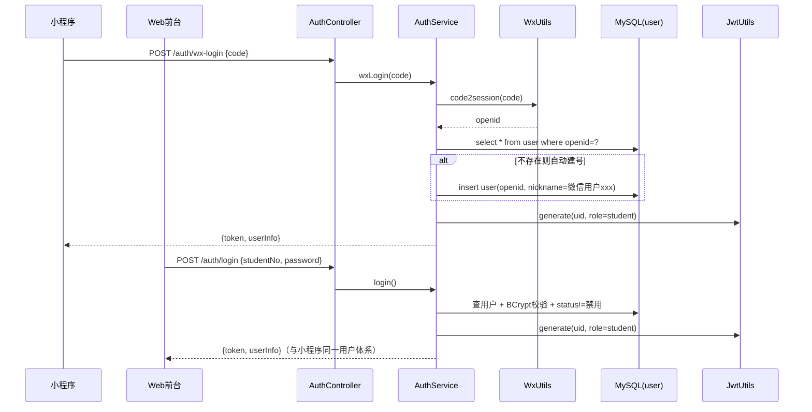
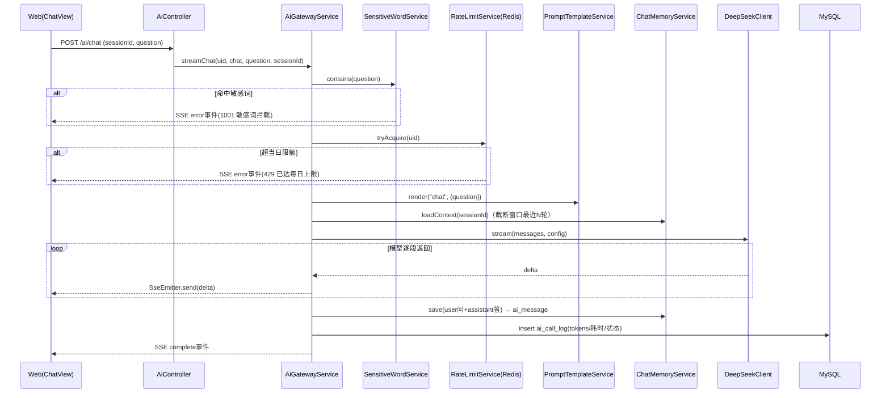
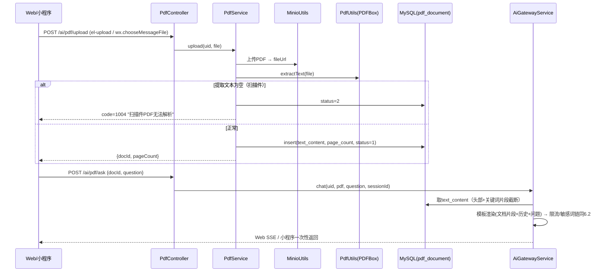
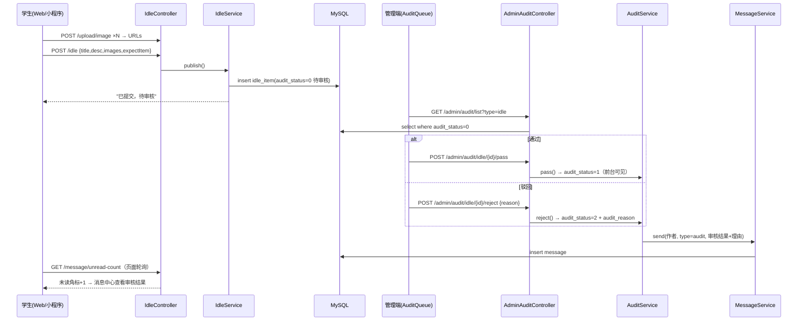
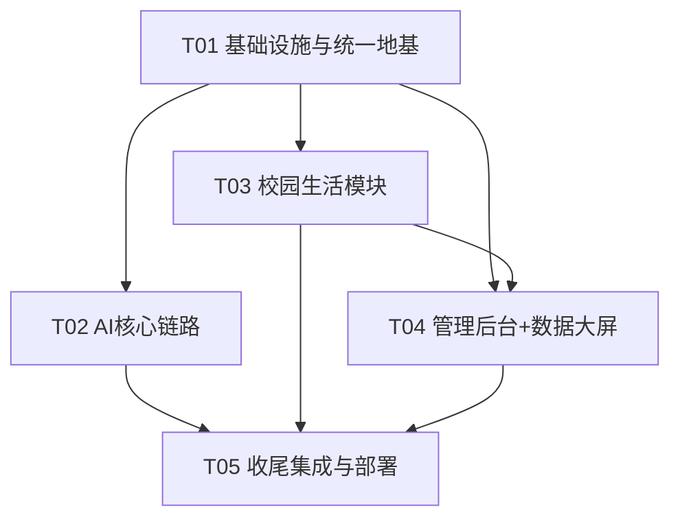

# 基于SpringBoot的AI校园综合服务平台 —— 系统架构设计

> 架构师：高见远（Gao） · 依据《PRD.md》（36条需求池，17条P0）与《程序开发方案.md》（已拍板决策）设计
> 输入决策已锁定：DeepSeek（OpenAI兼容）、Web端SSE/小程序一次性返回、先审后发、纯撮合+互评、报名审批制、轮询消息、仅文本型PDF、统一JWT（Web账号密码 + 小程序openid）。

---

## 1. 实现方案与框架选型

### 1.1 核心技术难点与对策

| # | 难点 | 对策 |
|---|---|---|
| 1 | AI流式输出与三端协议差异 | 后端统一 `AiGatewayService.chat()`；Web 用 `SseEmitter` 逐段推送；小程序走 `/chat/sync` 一次性返回，复用同一网关逻辑，仅Controller出口不同 |
| 2 | AI网关可管控（限流/敏感词/模板/日志/多模型预留） | 网关内部固定责任链：`DFA敏感词 → Redis计数限流 → 模板渲染 → 组上下文 → 调用模型 → 落库+日志`。模型配置（baseUrl/model/apiKey/参数）存 `ai_config` 表，启动加载+改后刷新缓存，天然支持换模型 |
| 3 | 先审后发状态机（闲置/活动/失物/动态） | 四类表统一 `audit_status`（0待审/1通过/2驳回）+ `audit_reason`；前台列表 SQL 统一过滤 `audit_status=1`；管理端一个通用审核接口按 `biz_type` 路由 |
| 4 | 双登录体系统一用户 | `user` 表同时存 `password`（Web）与 `openid`（小程序）；小程序 code2session 换 openid 自动建号；绑定手机号时若已存在同手机账号则合并 openid，两端发同一套 JWT（claims: uid, role） |
| 5 | PDF解析问答 | PDFBox 提取全文存 `pdf_document.text_content`（LONGTEXT）；提问时取"文档头部 + 与问题关键词相关片段"截断进上下文窗口，避免超 token |
| 6 | 消息触达（无 WebSocket） | 业务事件（审核结果/预约/报名审批/互评）同步写 `message` 表；前端进入页面 + 30s 定时轮询 `unread-count`；小程序另接订阅消息模板 |
| 7 | 扫码签到 | 签到二维码内容 = `campus://signin/{activityId}/{token}`（token=活动ID+密钥HMAC，防伪造）；小程序 `wx.scanCode` 解析后调签到接口 |

### 1.2 框架与库选型（含理由）

**后端（单工程多包，Java 17 + SpringBoot 3.x）**

| 依赖 | 选型 | 理由 |
|---|---|---|
| Web/校验 | spring-boot-starter-web + validation | 标准MVC分层 |
| ORM | MyBatis-Plus 3.5.x | CRUD零XML、分页插件、逻辑删除，毕设效率最高 |
| 缓存/限流 | spring-data-redis（Lettuce） | 限流计数、AI配置缓存、会话上下文缓存 |
| 鉴权 | jjwt 0.11.x | 轻量，双登录体系共用 |
| 大模型调用 | OkHttp 4 + SseEmitter | DeepSeek OpenAI兼容协议，OkHttp支持SSE流式读取 |
| 文件存储 | minio 8.5.x | 图片/PDF统一对象存储 |
| PDF | pdfbox 3.0.x | 文本提取（仅文本型PDF） |
| 工具 | hutool-all 5.8.x | DFA敏感词树、HMAC、日期等 |
| 简化 | lombok | 实体样板代码 |

**Web双端（Vue3 + Vite + Element Plus + Pinia + Vue Router + Axios）**

- AI回复渲染：`markdown-it + highlight.js`；代码编辑器：`@guolao/vue-monaco-editor`（Monaco 免配置封装）；
- 管理端图表：`echarts@5`；公告/动态编辑器：`@wangeditor/editor-for-vue`；
- 不强制 TypeScript（毕设体量，JS即可）。

**小程序**：原生 WXML/WXSS/JS，主包 + 4 个子包（pages-ai / pages-idle / pages-activity / pages-lostfound），Markdown 渲染用 `towxml`。

### 1.3 架构模式

- 后端：经典三层 **Controller → Service → Mapper(MP)** + 独立 **aigateway** 子系统（网关层，业务Service不直接碰模型API）；
- Web前端：**MVVM**（Vue）+ 按业务模块划分 views/api；
- 鉴权：**JWT + 拦截器**（学生端/管理端两条拦截链，role 校验）。

---

## 2. 文件列表

### 2.1 后端 `server/`（包根：`com.campus.platform`）

```
server/
├─ pom.xml
├─ src/main/resources/
│  ├─ application.yml                 # 数据源/Redis/MinIO/AI默认配置
│  ├─ db/schema.sql                   # 全量建表脚本（23张表）
│  └─ sensitive-words.txt             # DFA初始敏感词库
└─ src/main/java/com/campus/platform/
   ├─ PlatformApplication.java
   ├─ common/
   │  ├─ R.java                       # 统一响应体 {code,message,data}
   │  ├─ ResultCode.java              # 错误码枚举
   │  ├─ PageQuery.java / PageResult.java
   │  ├─ BizException.java
   │  ├─ GlobalExceptionHandler.java
   │  ├─ UserContext.java             # ThreadLocal 当前用户(uid/role)
   │  └─ Constants.java               # audit_status 等枚举常量
   ├─ config/
   │  ├─ WebMvcConfig.java            # 拦截器注册+CORS
   │  ├─ MybatisPlusConfig.java       # 分页插件
   │  ├─ RedisConfig.java
   │  └─ MinioConfig.java
   ├─ interceptor/
   │  ├─ JwtInterceptor.java          # 学生端鉴权
   │  └─ AdminInterceptor.java        # 管理端 role=admin 校验
   ├─ utils/
   │  ├─ JwtUtils.java / RedisUtils.java / MinioUtils.java
   │  ├─ WxUtils.java                 # code2session
   │  ├─ PdfUtils.java                # PDFBox文本提取
   │  └─ SignTokenUtils.java          # 签到二维码HMAC
   ├─ aigateway/                      # ★ AI网关子系统
   │  ├─ AiGatewayService.java        # 统一入口 chat/sync/stream
   │  ├─ DeepSeekClient.java          # OpenAI兼容协议+SSE解析
   │  ├─ PromptTemplateService.java   # 模板DB读取+渲染
   │  ├─ RateLimitService.java        # Redis 每用户每日计数
   │  ├─ SensitiveWordService.java    # DFA过滤（输入+输出）
   │  ├─ ChatMemoryService.java       # 上下文窗口组装
   │  └─ AiConfigHolder.java          # ai_config 缓存+刷新
   ├─ entity/    # 23个实体，对应第3节表（User/Admin/AiSession/AiMessage/AiCallLog/AiConfig/
   │             #  PromptTemplate/PdfDocument/WrongQuestion/IdleItem/IdleAppointment/IdleReview/
   │             #  Activity/ActivityMember/ActivitySignin/LostFound/Notice/Post/PostComment/
   │             #  PostLike/Report/Message/SensitiveWord）
   ├─ mapper/    # 23个 BaseMapper 接口
   ├─ dto/       # LoginDTO/WxLoginDTO/IdlePublishDTO/ActivityPublishDTO/ReportDTO/AuditDTO...
   ├─ vo/        # ItemDetailVO/HomeAggregateVO/StatsVO/UnreadCountVO...
   ├─ service/   # 接口 + impl/：AuthService, UserService, UploadService,
   │             #  AiChatService, PdfService, WrongQuestionService,
   │             #  IdleService, ActivityService, LostFoundService, NoticeService,
   │             #  PostService, MessageService, ReportService,
   │             #  AdminUserService, AuditService, AdminNoticeService, AiAdminService, StatsService
   └─ controller/
      ├─ AuthController / UserController / UploadController
      ├─ AiController / PdfController / WrongQuestionController
      ├─ IdleController / ActivityController / LostFoundController
      ├─ NoticeController / PostController / MessageController / ReportController
      └─ admin/
         ├─ AdminAuthController / AdminUserController / AdminAuditController
         ├─ AdminReportController / AdminNoticeController
         ├─ AdminAiController(配置+日志) / AdminStatsController
```

### 2.2 Web学生前台 `web/frontend/student/`

```
web/frontend/student/
├─ package.json / vite.config.js / index.html
└─ src/
   ├─ main.js / App.vue
   ├─ api/         # request.js + auth.js ai.js idle.js activity.js lostfound.js
   │               # notice.js post.js message.js report.js user.js wrong.js
   ├─ utils/       # request.js(axios封装) markdown.js date.js auth.js
   ├─ store/       # user.js message.js
   ├─ router/      # index.js + 登录守卫
   ├─ layout/      # MainLayout.vue(顶栏+消息铃铛) 
   ├─ components/  # UploadImg.vue ItemCard.vue CommentList.vue ChatBubble.vue EmptyBox.vue
   └─ views/
      ├─ login/Login.vue Register.vue
      ├─ home/Home.vue
      ├─ ai/ChatView.vue(答疑+PDF问答+提纲 Tab) CodeFix.vue WrongBook.vue
      ├─ idle/List.vue Publish.vue Detail.vue MyAppointments.vue
      ├─ activity/List.vue Publish.vue Detail.vue MySignup.vue
      ├─ lostfound/List.vue Publish.vue Detail.vue
      ├─ social/PostSquare.vue
      ├─ notice/List.vue Detail.vue
      ├─ message/MessageCenter.vue
      └─ profile/Profile.vue
```

### 2.3 Web管理后台 `web/frontend/admin/`

```
web/frontend/admin/
├─ package.json / vite.config.js / index.html
└─ src/
   ├─ main.js / App.vue
   ├─ api/         # request.js auth.js user.js audit.js report.js notice.js aiConfig.js stats.js
   ├─ store/       # admin.js
   ├─ router/      # index.js 动态路由+权限守卫
   ├─ layout/      # AdminLayout.vue(侧边菜单+顶栏+tags-view)
   └─ views/
      ├─ login/Login.vue
      ├─ dashboard/Dashboard.vue      # ECharts 数据大屏
      ├─ user/UserList.vue
      ├─ audit/AuditQueue.vue         # tab切换四类内容
      ├─ report/ReportList.vue
      ├─ notice/NoticeManage.vue NoticeEdit.vue
      ├─ ai/AiConfig.vue AiLogs.vue
      └─ system/AdminList.vue         # P2
```

### 2.4 微信小程序 `miniprogram/`

```
miniprogram/
├─ app.js app.json app.wxss project.config.json
├─ utils/request.js auth.js format.js
├─ components/    # item-card/ chat-bubble/ upload-grid/
├─ pages/
│  ├─ index/      # 首页：公告轮播+8宫格+最新内容流
│  ├─ login/      # wx.login一键登录 + 账号绑定
│  ├─ notice/     # 公告列表/详情
│  ├─ message/    # 消息中心
│  └─ my/         # 我的：资料/我的发布/我的报名/错题本/设置
├─ pages-ai/      # 子包：chat(一次性返回+towxml) code-fix pdf wrong outline
├─ pages-idle/    # 子包：list publish detail appoint review
├─ pages-activity/# 子包：list publish detail signup signin(scanCode)
└─ pages-lostfound/ # 子包：list publish detail
```

---

## 3. 数据库设计（MySQL 8，23张表，全部 `utf8mb4`，InnoDB）

> 通用约定：主键统一 `id BIGINT AUTO_INCREMENT`；时间统一 `DATETIME` 默认 `CURRENT_TIMESTAMP`；所有用户发布内容统一 `audit_status TINYINT`（0待审核/1通过/2驳回）+ `audit_reason VARCHAR(255)`；`status` 各表自定义；逻辑删除暂不加（毕设用物理删除+下架状态）。

### 3.1 账号与基础

**user（用户表）**
| 字段 | 类型 | 说明 |
|---|---|---|
| id | BIGINT PK | |
| student_no | VARCHAR(20) UNIQUE | 学号（注册必填，不做真认证） |
| nickname | VARCHAR(32) | 昵称 |
| password | VARCHAR(100) | BCrypt；小程序自动建号时可为空 |
| phone | VARCHAR(11) | 手机号，用于账号合并绑定 |
| openid | VARCHAR(64) UNIQUE | 微信openid，小程序登录凭证 |
| avatar | VARCHAR(255) | 头像URL |
| gender/bio | TINYINT/VARCHAR(255) | |
| status | TINYINT | 0正常 1禁用 |
| last_login_time | DATETIME | 数据大屏"今日活跃"口径之一 |
| create_time/update_time | DATETIME | |

**admin（管理员表）**
| 字段 | 类型 | 说明 |
|---|---|---|
| id | BIGINT PK | |
| username/password | VARCHAR | 独立登录，BCrypt |
| nickname/avatar | VARCHAR | |
| role | VARCHAR(20) | super/audit（D8 预留，P2扩展为角色表） |
| status | TINYINT | 0正常 1禁用 |
| create_time | DATETIME | |

### 3.2 AI 子系统（6张表）

**ai_session（AI会话）**
| id PK | user_id BIGINT→user | scene VARCHAR(16)（chat/pdf/code/outline） | title VARCHAR(64) | doc_id BIGINT→pdf_document NULL | create_time | update_time |

**ai_message（AI消息）**
| id PK | session_id→ai_session | role VARCHAR(10)（user/assistant/system） | content TEXT | tokens INT | create_time |

**ai_call_log（AI调用日志，D6）**
| id PK | user_id→user | scene | model VARCHAR(32) | prompt_tokens INT | completion_tokens INT | cost_ms INT | status TINYINT（0成功1失败） | error_msg VARCHAR(255) | create_time |

**ai_config（AI配置键值表，D5）**
| id PK | config_key VARCHAR(64) UNIQUE | config_value VARCHAR(512) | description | update_time |
> 预置key：`base_url`、`api_key`、`model_name`、`temperature`、`max_tokens`、`timeout_ms`、`retry_times`、`rate_limit_per_day`

**prompt_template（提示词模板，B2/D5）**
| id PK | scene VARCHAR(16)（chat/code_fix/pdf/outline/quiz） | name VARCHAR(64) | content TEXT（含 `{question}` 等占位符） | enabled TINYINT | update_time |

**pdf_document（PDF文档，B3）**
| id PK | user_id→user | file_name | file_url VARCHAR(255)（MinIO） | page_count INT | text_content LONGTEXT | status TINYINT（0解析中1成功2失败-扫描件） | create_time |

### 3.3 学习辅助

**wrong_question（错题本，B6/B7）**
| id PK | user_id→user | subject VARCHAR(32) | tag VARCHAR(32) | question TEXT | answer TEXT | analysis TEXT | source VARCHAR(16)（manual/ai） | create_time |

### 3.4 校园生活

**idle_item（闲置物品，C1）**
| id PK | user_id→user | title VARCHAR(64) | description TEXT | images VARCHAR(1000)（JSON数组） | expect_item VARCHAR(128)（期望换物） | category VARCHAR(32) | audit_status/audit_reason | status TINYINT（0在架1已预约2已完成3已下架） | view_count INT | create_time/update_time |

**idle_appointment（闲置预约）**
| id PK | item_id→idle_item | buyer_id→user | seller_id→user | message VARCHAR(255) | status TINYINT（0待确认1已接受2已拒绝3已完成4已取消） | create_time/update_time |

**idle_review（闲置互评，对应方案中 idle_comment）**
| id PK | appointment_id→idle_appointment | from_user_id→user | to_user_id→user | score TINYINT（1-5） | content VARCHAR(255) | create_time |
> 联合唯一索引 (appointment_id, from_user_id)，防重复评价。

**activity（活动，C2）**
| id PK | user_id→user（发布者） | title | description TEXT | images | category | location VARCHAR(128) | start_time/end_time DATETIME | signup_deadline DATETIME | max_members INT | audit_status/audit_reason | status TINYINT（0报名中1已满2已结束3已下架） | create_time |

**activity_member（活动报名，审批制入队 Q5）**
| id PK | activity_id→activity | user_id→user | remark VARCHAR(255)（报名说明/组队信息） | status TINYINT（0待审批1已通过2已拒绝） | create_time | 联合唯一索引(activity_id,user_id) |

**activity_signin（活动签到，C3）**
| id PK | activity_id→activity | user_id→user | sign_time DATETIME | 联合唯一索引(activity_id,user_id) |

**lost_found（失物招领，C4）**
| id PK | user_id→user | type TINYINT（0失物1招领） | title | description TEXT | images | location | happen_time DATETIME | contact VARCHAR(64) | audit_status/audit_reason | status TINYINT（0进行中1已完成2已下架） | create_time |

**notice（公告，C5/D4）**
| id PK | admin_id→admin | title | content TEXT（Markdown） | cover VARCHAR(255) | status TINYINT（0草稿1已发布2已下线） | publish_time | create_time |

**post（动态，C6）**
| id PK | user_id→user | content TEXT | images | like_count INT | comment_count INT | audit_status/audit_reason | create_time |

**post_comment（动态评论，DFA机审+举报兜底）**
| id PK | post_id→post | user_id→user | content VARCHAR(500) | status TINYINT（0正常1命中敏感词隐藏） | create_time |

**post_like（点赞，防重复）**
| id PK | post_id→post | user_id→user | create_time | 联合唯一索引(post_id,user_id) |

**report（举报，D3）**
| id PK | reporter_id→user | target_type VARCHAR(16)（idle/activity/lostfound/post/comment） | target_id BIGINT | reason_type VARCHAR(32) | reason VARCHAR(500) | status TINYINT（0待处理1已处理） | handle_result VARCHAR(255) | handler_id→admin | handle_time | create_time |

**message（消息通知，C7）**
| id PK | user_id→user（接收人） | type VARCHAR(16)（system/interact/audit） | title VARCHAR(64) | content VARCHAR(500) | biz_type VARCHAR(16) | biz_id BIGINT | is_read TINYINT | create_time | 索引(user_id,is_read) |

**sensitive_word（敏感词库，DFA）**
| id PK | word VARCHAR(32) UNIQUE | create_time |
> 启动时与 sensitive-words.txt 合并加载进内存DFA树。

### 3.5 关联关系总览

```
user 1─n ai_session 1─n ai_message
user 1─n pdf_document ── ai_session.doc_id
user 1─n wrong_question
user 1─n idle_item 1─n idle_appointment 1─2 idle_review
user 1─n activity 1─n activity_member / activity_signin
user 1─n lost_found
admin 1─n notice；admin 1─n report(处置)
user 1─n post 1─n post_comment / post_like
user 1─n message / report(发起) / ai_call_log
```

---

## 4. 核心接口清单（RESTful，三端共用，约 72 个）

> 统一前缀 `/api`；鉴权列：🟢公开 / 🔵学生JWT / 🔴管理员JWT。统一响应 `{code,message,data}`，分页参数 `pageNum/pageSize`。

### 4.1 认证与用户

| 方法 | 路径 | 说明 | 鉴权 |
|---|---|---|---|
| POST | /auth/register | Web注册（学号+密码+昵称） | 🟢 |
| POST | /auth/login | Web账号密码登录 → JWT | 🟢 |
| POST | /auth/wx-login | 小程序 code 换 openid，自动建号 → 同一JWT | 🟢 |
| POST | /auth/wx-bind | 小程序绑定学号/手机号（合并账号） | 🔵 |
| POST | /admin/auth/login | 管理员独立登录 | 🟢 |
| GET | /user/info | 当前用户信息 | 🔵 |
| PUT | /user/profile | 资料编辑（昵称/头像/简介） | 🔵 |
| PUT | /user/password | 修改密码 | 🔵 |
| POST | /upload/image | 图片上传→MinIO URL（≤5MB） | 🔵 |
| POST | /upload/file | 文件上传（PDF，≤20MB） | 🔵 |

### 4.2 AI 学习服务

| 方法 | 路径 | 说明 | 鉴权 |
|---|---|---|---|
| POST | /ai/session | 新建会话（scene: chat/pdf/code/outline） | 🔵 |
| GET | /ai/session/list | 会话列表（按scene） | 🔵 |
| PUT | /ai/session/{id} | 重命名 | 🔵 |
| DELETE | /ai/session/{id} | 删除会话（含消息） | 🔵 |
| GET | /ai/session/{id}/messages | 历史消息（分页，上拉加载） | 🔵 |
| POST | /ai/chat | **Web端SSE流式答疑**（SseEmitter） | 🔵 |
| POST | /ai/chat/sync | 小程序一次性返回 | 🔵 |
| POST | /ai/pdf/upload | 上传PDF→PDFBox解析→docId | 🔵 |
| GET | /ai/pdf/{docId} | 解析状态与摘要 | 🔵 |
| POST | /ai/pdf/ask | 针对文档多轮提问（sync/SSE同chat） | 🔵 |
| POST | /ai/code/fix | 代码纠错（代码+语言→Markdown结果） | 🔵 |
| POST | /ai/outline | 复习提纲生成（学科/章节/主题） | 🔵 |
| POST | /ai/quiz | 基于错题生成同类习题+解析 | 🔵 |
| GET/POST/PUT/DELETE | /wrong-question[/…] | 错题本 CRUD + `?subject=`筛选 | 🔵 |

### 4.3 校园生活

| 方法 | 路径 | 说明 | 鉴权 |
|---|---|---|---|
| POST | /idle | 发布闲置（进入待审核） | 🔵 |
| GET | /idle/list | 列表检索（关键词/分类/分页，仅audit通过） | 🟢 |
| GET | /idle/{id} | 详情 | 🟢 |
| PUT / DELETE | /idle/{id} | 编辑 / 下架 | 🔵(本人) |
| GET | /idle/my | 我的发布 | 🔵 |
| POST | /idle/{id}/appoint | 发起预约 → 消息通知卖家 | 🔵 |
| PUT | /idle/appoint/{id}/handle | 卖家接受/拒绝 | 🔵 |
| PUT | /idle/appoint/{id}/finish | 双方确认完成 | 🔵 |
| POST | /idle/appoint/{id}/review | 互评（1-5分+评语） | 🔵 |
| GET | /idle/appoint/my | 我的预约（买/卖双向） | 🔵 |
| POST | /activity | 发布活动（待审核） | 🔵 |
| GET | /activity/list /activity/{id} | 检索 / 详情（含报名数） | 🟢 |
| POST | /activity/{id}/signup | 报名（审批制，remark组队信息） | 🔵 |
| GET | /activity/{id}/members | 报名名单（发布者可见） | 🔵 |
| PUT | /activity/member/{id}/handle | 审批通过/拒绝 → 消息通知 | 🔵 |
| GET | /activity/{id}/signin-qrcode | 发布者获取签到二维码内容 | 🔵(发布者) |
| POST | /activity/signin | 扫码签到（token校验） | 🔵 |
| GET | /activity/my | 我的发布/我的报名 | 🔵 |
| POST | /lostfound | 发布失物/招领（待审核） | 🔵 |
| GET | /lostfound/list /lostfound/{id} | 检索(type筛选) / 详情 | 🟢 |
| PUT | /lostfound/{id}/finish | 标记完成 | 🔵(本人) |
| GET | /notice/list /notice/{id} | 公告列表/详情（已发布） | 🟢 |
| GET | /home/aggregate | 首页聚合（公告轮播+各模块最新3条） | 🟢 |
| POST | /post | 发动态（待审核） | 🔵 |
| GET | /post/list | 动态广场 | 🟢 |
| POST/DELETE | /post/{id}/like | 点赞/取消（计数+防重） | 🔵 |
| POST | /post/{id}/comment | 评论（DFA机审） | 🔵 |
| GET | /post/{id}/comments | 评论列表 | 🟢 |
| POST | /report | 发起举报 | 🔵 |
| GET | /message/list | 消息列表（type筛选/分页） | 🔵 |
| GET | /message/unread-count | 未读数（轮询角标） | 🔵 |
| PUT | /message/{id}/read / /message/read-all | 已读 | 🔵 |

### 4.4 管理后台（/admin 前缀，全部 🔴）

| 方法 | 路径 | 说明 |
|---|---|---|
| GET | /admin/user/list | 用户列表/搜索（学号/昵称/状态） |
| PUT | /admin/user/{id}/status | 禁用/解封 |
| PUT | /admin/user/{id}/reset-password | 重置密码 |
| GET | /admin/audit/list?type=idle/activity/lostfound/post | 待审队列 |
| POST | /admin/audit/{type}/{id}/pass | 通过 → 通知作者 |
| POST | /admin/audit/{type}/{id}/reject | 驳回（必填理由）→ 通知作者 |
| GET | /admin/report/list | 举报列表（状态筛选） |
| POST | /admin/report/{id}/handle | 处置（下架/警告/封禁）→ 通知举报人 |
| GET/POST/PUT | /admin/notice[/…] | 公告管理（Markdown编辑） |
| PUT | /admin/notice/{id}/publish / /offline | 发布/下线 |
| GET/PUT | /admin/ai/config | AI参数读取/修改（即时生效） |
| GET/POST/PUT | /admin/ai/prompts | 提示词模板管理 |
| GET | /admin/ai/logs | AI调用日志（用户/场景/结果筛选） |
| GET | /admin/stats/overview | 数字卡片（总用户/今日活跃/今日AI调用） |
| GET | /admin/stats/trend | 近30天用户增长+AI调用折线 |
| GET | /admin/stats/module | 各模块发布量柱状 |
| GET | /admin/stats/pie | 失物状态+举报类型饼图 |
| GET/POST/PUT | /admin/system/admin | 子管理员管理（P2） |

---

## 5. 数据结构与接口（类图）

另存：`docs/class-diagram.mermaid`

```mermaid
classDiagram
    class User {
        +Long id
        +String studentNo
        +String nickname
        +String password
        +String openid
        +String phone
        +Integer status
    }
    class Admin {
        +Long id
        +String username
        +String role
    }
    class AiSession {
        +Long id
        +Long userId
        +String scene
        +String title
        +Long docId
    }
    class AiMessage {
        +Long id
        +Long sessionId
        +String role
        +String content
        +Integer tokens
    }
    class PdfDocument {
        +Long id
        +Long userId
        +String fileUrl
        +String textContent
        +Integer status
    }
    class WrongQuestion {
        +Long id
        +Long userId
        +String subject
        +String question
        +String answer
    }
    class IdleItem {
        +Long id
        +Long userId
        +String title
        +String expectItem
        +Integer auditStatus
        +Integer status
    }
    class IdleAppointment {
        +Long id
        +Long itemId
        +Long buyerId
        +Long sellerId
        +Integer status
    }
    class Activity {
        +Long id
        +Long userId
        +String title
        +Date startTime
        +Integer maxMembers
        +Integer auditStatus
    }
    class ActivityMember {
        +Long id
        +Long activityId
        +Long userId
        +Integer status
    }
    class LostFound {
        +Long id
        +Long userId
        +Integer type
        +Integer auditStatus
    }
    class Post {
        +Long id
        +Long userId
        +String content
        +Integer likeCount
        +Integer auditStatus
    }
    class Message {
        +Long id
        +Long userId
        +String type
        +Boolean isRead
    }
    class Report {
        +Long id
        +Long reporterId
        +String targetType
        +Long targetId
        +Integer status
    }
    class AiGatewayService {
        +chat(userId, scene, question, sessionId) String
        +streamChat(userId, scene, question, sessionId) SseEmitter
        -buildPrompt(scene, question, context)
    }
    class DeepSeekClient {
        +stream(messages, config, callback)
        +sync(messages, config) String
    }
    class RateLimitService {
        +tryAcquire(userId) boolean
    }
    class SensitiveWordService {
        +contains(text) boolean
        +filter(text) String
    }
    class PromptTemplateService {
        +render(scene, params) String
    }
    class ChatMemoryService {
        +loadContext(sessionId) List~AiMessage~
        +save(sessionId, role, content)
    }
    class AiChatService {
        +createSession(userId, scene)
        +ask(dto) SseEmitter
    }
    class AuditService {
        +pass(bizType, id)
        +reject(bizType, id, reason)
    }
    class MessageService {
        +send(userId, type, title, content, bizType, bizId)
    }

    User "1" --> "*" AiSession
    AiSession "1" --> "*" AiMessage
    User "1" --> "*" PdfDocument
    User "1" --> "*" IdleItem
    IdleItem "1" --> "*" IdleAppointment
    User "1" --> "*" Activity
    Activity "1" --> "*" ActivityMember
    User "1" --> "*" Post
    User "1" --> "*" Message
    AiChatService --> AiGatewayService
    AiGatewayService --> DeepSeekClient
    AiGatewayService --> RateLimitService
    AiGatewayService --> SensitiveWordService
    AiGatewayService --> PromptTemplateService
    AiGatewayService --> ChatMemoryService
    AuditService --> MessageService : 审核结果通知
```



---

## 6. 程序调用流程（时序图）

另存：`docs/sequence-diagram.mermaid`

### 6.1 统一登录（Web + 小程序互通）



### 6.2 AI答疑 SSE 流式对话（Web）



### 6.3 PDF 上传解析问答



### 6.4 闲置发布 → 审核 → 通知闭环（先审后发）



---

## 7. 任务列表（有序，≤5个，对应开发方案六阶段）

> 任务按依赖排序；建表脚本、三端脚手架全部收拢在 T01；T04 逻辑上依赖 T03 产出内容数据，但表结构与接口可并行开发。

### T01 项目基础设施与统一地基（对应阶段1）【P0，无依赖】
**目标**：可登录的三端骨架 + 全部建表 + MinIO/Redis 接入 + 统一响应/鉴权体系。
**文件**：
- `server/pom.xml`、`application.yml`、`db/schema.sql`（23张表）、`sensitive-words.txt`
- `common/`（R、ResultCode、PageQuery、BizException、GlobalExceptionHandler、UserContext、Constants）
- `config/`（4个配置类）、`interceptor/`（Jwt/Admin拦截器）、`utils/`（Jwt/Redis/Minio/Wx工具）
- `entity/`+`mapper/`（User、Admin）、`controller/AuthController、UserController、UploadController`、`service/AuthService、UserService、UploadService`
- `web/frontend/student/`+`web/frontend/admin/`：`package.json`、`vite.config.js`、`index.html`、`main.js`、`App.vue`、`utils/request.js`、`store/`、`router/`（含守卫）、登录页
- `miniprogram/`：`app.js/app.json/app.wxss`、`project.config.json`、`utils/request.js`、登录页
**验收**：Web注册登录、小程序 wx.login 自动建号、JWT 拦截生效、图片上传回显。

### T02 AI 核心链路（对应阶段2）【P0，依赖T01】
**目标**：AI网关 + 答疑SSE + PDF问答 + 代码纠错，AI学习中心三端可用。
**文件**：
- `aigateway/`（AiGatewayService、DeepSeekClient、PromptTemplateService、RateLimitService、SensitiveWordService、ChatMemoryService、AiConfigHolder）
- `entity/mapper`：AiSession、AiMessage、AiCallLog、AiConfig、PromptTemplate、PdfDocument
- `controller/AiController、PdfController`、`service/AiChatService、PdfService`、`utils/PdfUtils`
- `web/frontend/student/views/ai/ChatView.vue、CodeFix.vue`、`api/ai.js`、`utils/markdown.js`、`components/ChatBubble.vue`
- `miniprogram/frontend/pages-ai/`（chat、code-fix、pdf）
**验收**：多轮上下文、SSE逐段输出、限流/敏感词拦截提示、50页PDF 30秒内解析、代码纠错高亮渲染、小程序一次性返回。

### T03 校园生活模块（对应阶段3）【P0，依赖T01】
**目标**：闲置/活动/失物/公告/动态/消息/举报发起，学生端（Web+小程序）功能完整。
**文件**：
- 后端 `entity/mapper`：IdleItem、IdleAppointment、IdleReview、Activity、ActivityMember、ActivitySignin、LostFound、Notice、Post、PostComment、PostLike、Report、Message、WrongQuestion、SensitiveWord
- `controller/`：Idle、Activity、LostFound、Notice、Post、Message、Report、WrongQuestion 八个Controller + 对应 Service
- `utils/SignTokenUtils`（签到二维码）
- `web/frontend/student/views/`：idle/ activity/ lostfound/ notice/ social/ message/ profile/ home/ + `components/UploadImg、ItemCard、CommentList`
- `miniprogram/`：`pages-idle/`、`pages-activity/`、`pages-lostfound/`、`pages/index|notice|message|my/`
**验收**：闲置"发布→预约→确认→互评"闭环、活动"发布→报名审批→扫码签到"、失物/公告/动态/消息中心、错题本CRUD。

### T04 管理后台闭环 + 数据大屏（对应阶段4+5）【P0，依赖T01、T03】
**目标**：用户管控、四类内容审核、举报闭环、公告管理、AI配置/日志、ECharts大屏。
**文件**：
- `controller/admin/`（AdminAuth、AdminUser、AdminAudit、AdminReport、AdminNotice、AdminAi、AdminStats 七个Controller）+ `service/`（AdminUser、Audit、AdminNotice、AiAdmin、StatsService）
- `web/frontend/admin/` 全部 views：`dashboard/Dashboard.vue`、`user/`、`audit/AuditQueue.vue`、`report/`、`notice/`、`ai/AiConfig.vue AiLogs.vue`、`system/` + `layout/AdminLayout.vue` + 动态路由 + `api/`六个模块
**验收**：待审队列通过/驳回→消息送达、举报处置闭环、公告即时可见、AI配置改后即时生效、4类图表+3数字卡片与库表一致。

### T05 收尾集成与部署（对应阶段6 + P1补齐）【P1，依赖T01-T04】
**目标**：P1功能补齐（提纲生成、智能习题、订阅消息）、全链路测试、性能优化、部署文档。
**文件**：
- 后端：`AiController` 增补 `/ai/outline`、`/ai/quiz`；订阅消息推送工具
- `web/frontend/student/views/ai/WrongBook.vue`（生成同类习题）、`miniprogram/frontend/pages-ai/`（outline、wrong）
- 部署：`nginx.conf`、`deploy/`（启动脚本+部署说明.md）、JMeter 压测脚本
- 全量修bug、图片懒加载/压缩、Redis热点缓存
**验收**：答辩主链路全流程演示通过，并发20 AI接口错误率<5%，部署文档可一键启动。

### 7.1 任务依赖图



---

## 8. 依赖包列表

### 8.1 Maven（server/pom.xml）

```xml
- org.springframework.boot:spring-boot-starter-web:3.2.x        # Web MVC
- org.springframework.boot:spring-boot-starter-validation:3.2.x # 参数校验
- org.springframework.boot:spring-boot-starter-data-redis:3.2.x # 缓存/限流
- com.baomidou:mybatis-plus-spring-boot3-starter:3.5.7          # ORM
- com.mysql:mysql-connector-j:8.3.0                             # MySQL驱动
- io.jsonwebtoken:jjwt-api/impl/jackson:0.11.5                  # JWT
- io.minio:minio:8.5.9                                          # 对象存储
- org.apache.pdfbox:pdfbox:3.0.2                                # PDF文本提取
- com.squareup.okhttp3:okhttp:4.12.0                            # DeepSeek SSE调用
- com.squareup.okhttp3:okhttp-sse:4.12.0                        # SSE解析
- cn.hutool:hutool-all:5.8.27                                   # DFA/HMAC/工具
- org.springframework.security:spring-security-crypto:6.2.x     # 仅BCrypt（不引入完整Security）
- org.projectlombok:lombok:1.18.32
```

### 8.2 npm（web/frontend/student / web/frontend/admin 共用，标注处仅管理端）

```
- vue@^3.4.x
- vite@^5.x
- vue-router@^4.3.x
- pinia@^2.1.x
- element-plus@^2.7.x
- axios@^1.7.x
- markdown-it@^14.x
- highlight.js@^11.x
- @guolao/vue-monaco-editor@^1.5.x   # 代码纠错编辑器
- @wangeditor/editor-for-vue@^5.1.x  # 公告/动态富文本
- echarts@^5.5.x                     # 仅 web/frontend/admin
- dayjs@^1.11.x
```

### 8.3 小程序

```
- towxml@3.x      # Markdown/代码块渲染
（其余原生能力：wx.login / wx.chooseMessageFile / wx.chooseMedia / wx.scanCode / 订阅消息）
```

---

## 9. 共享知识（跨文件约定，全体工程必须遵守）

1. **统一响应体**：所有接口返回 `{"code":200,"message":"success","data":{...}}`；前端 axios 拦截器统一解包，`code!=200` 弹提示。
2. **错误码约定**：
   - `200` 成功；`400` 参数校验失败；`401` 未登录/Token过期（前端跳登录）；`403` 无权限/账号被禁；`404` 资源不存在；`429` 触发限流（AI当日次数用尽）；`500` 系统异常；
   - 业务码：`1001` 敏感词拦截、`1002` AI服务调用失败、`1003` 内容待审核不可见、`1004` 扫描件PDF无法解析、`1005` 重复操作（重复报名/点赞/评价）。
3. **JWT约定**：Header `Authorization: Bearer <token>`；claims = `{uid, role: "student"|"admin", exp}`；有效期 7 天；密钥在 application.yml；小程序存 storage，Web 存 localStorage。
4. **分页约定**：请求 `pageNum`（默认1）、`pageSize`（默认10，最大50）；响应 `data = {total, pages, list}`。
5. **审核状态机**：`audit_status` 0待审核 / 1通过 / 2驳回，全平台四类UGC统一；前台一切列表查询强制 `audit_status=1`；评论例外（DFA机审，`status=1` 隐藏）。
6. **时间格式**：传输一律 `yyyy-MM-dd HH:mm:ss`；DB 存 DATETIME（北京时间，毕设不涉多时区）。
7. **命名规范**：后端包/类 Java 标准；接口路径全小写连字符（`/wrong-question`）；前端文件 PascalCase 组件 + camelCase 方法；DB 表/字段全小写下划线。
8. **图片/文件流**：一律「先传 `/upload/*` 拿 URL，再随业务表单提交」，DB 只存 URL；多图存 JSON 数组字符串。
9. **消息触发点**：审核通过/驳回、预约发起/接受/拒绝/完成、报名审批结果、举报处置结果、被评论/被点赞（后两者P1）。
10. **AI调用铁律**：任何业务代码不得直接调 DeepSeekClient，必须经 `AiGatewayService`（保证限流/敏感词/日志 100% 覆盖）；场景枚举：chat / pdf / code_fix / outline / quiz。
11. **"今日活跃"口径**（Q9已拍板）：当日有登录或任一写操作，以 `user.last_login_time` + 当日写操作日志综合判定（实现上以当日登录 + AI调用 + 发布行为任一并集去重）。

---

## 10. 待明确事项（假设已按建议默认处理）

| # | 事项 | 处理假设 |
|---|---|---|
| 1 | DeepSeek API Key 来源与额度 | 答辩前由本人申请，配置进 `ai_config.api_key`；网关对调用失败做降级提示 |
| 2 | 小程序 AppID 与订阅消息模板ID | 需注册小程序并申请模板（报名结果/审核结果/预约提醒3个），体验版演示即可（Q10） |
| 3 | MinIO 部署形态 | 本地 Docker 单节点，bucket=`campus`，匿名读策略供图片回显 |
| 4 | 管理员初始账号 | schema.sql 内置 `admin/admin123`（BCrypt），首次登录提示改密 |
| 5 | 活动签到二维码生成方式 | 不生成图片，后端只返回签名字符串，前端用 qrcode 库/小程序 canvas 现场渲染 |
| 6 | 学号实名（Q6） | 仅格式校验，不对接校方系统 |

---

*文档产出：架构师 高见远（Gao）· 软件团队*
